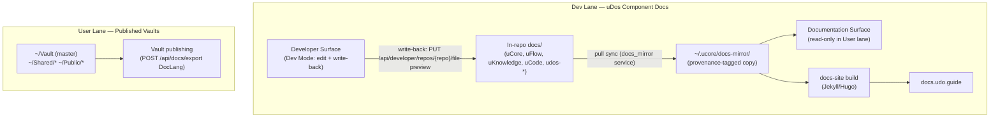

# Phase 11 — Docs Mirroring & Publishing (Lane-Separated)

- status: active
- owner: developer-lane
- started: 2026-08-13
- governance: stop-the-line required per wave

## Goal

Ship one readable Documentation surface that:

1. Mirrors uDos **component docs** (Dev Lane) — in-repo `docs/` is the source of truth.
2. Keeps the **user's published vaults** (User Lane) strictly separate — never merged into the component mirror or the docs-site.
3. Supports two-way sync in Dev Mode and a publish path to `docs.udo.guide`.

## Lane Separation (non-negotiable)

### Dev Lane — uDos Component Docs

| Concern | Value |
|---------|-------|
| Source of truth | In-repo `docs/` in core repos (`uCore`, `uFlow`, `uKnowledge`, `uCode`, `uVector`) and extension repos (`udos-*`) |
| Readable mirror | `~/.ucore/docs-mirror/` (internal, provenance-tagged) |
| Read surface | Documentation surface — read-only in User lane |
| Edit surface | Developer surface — Dev Mode only; writes back to the source repo |
| Publish target | `~/Public/doc-sites/<site>/` build → `docs.udo.guide` |

### User Lane — User Published Vaults

| Concern | Value |
|---------|-------|
| Source of truth | `~/Vault` (master), `~/Shared/*`, `~/Public/*` user content |
| Separation rule | User vault content is **never** indexed into the component mirror or built into the docs-site |
| Publish path | Existing DocLang export (`POST /api/docs/export`) → the user's own published spaces |

## Architecture

## Waves

### Wave 1 — docs_mirror sync engine (pull only)

- [ ] **D1.1** Add `backend/app/services/docs_mirror.py` with `sync_from_repos()`
  - Scan `REPO_DOC_ROOTS` (already defined in `documentation_api.py`) plus `udos-*` repos
  - Copy markdown into `~/.ucore/docs-mirror/<repo>/...`
  - Write a `_mirror.json` index: `{source_repo, source_path, mirrored_path, synced_at, git_sha}`
- [ ] **D1.2** Add `POST /api/docs/mirror/sync` and `GET /api/docs/mirror/status`
- [ ] **D1.3** Register the sync in the maintenance scheduler (periodic pull)
- [ ] **D1.4** Verify: no user-vault path (`~/Vault`, `~/Shared`, `~/Public`) is ever scanned by the mirror

### Wave 2 — provenance + two-way sync (Dev Mode gate)

- [ ] **D2.1** Tag every mirrored file with frontmatter provenance (`source_repo`, `source_path`, `git_sha`)
- [ ] **D2.2** Add `POST /api/docs/mirror/push` — writes a mirrored doc back to its source repo via the repo file API; reject unless Dev Mode is active
- [ ] **D2.3** Enforce lane gate server-side: User lane gets 403 on any push/reorg mutation
- [ ] **D2.4** Add `GET /api/docs/mirror/diff/{repo}/{path}` to show repo-vs-mirror drift

### Wave 3 — Surface lane separation

- [ ] **D3.1** Documentation surface reads from the mirror (not direct repo scan) for component docs
- [ ] **D3.2** Documentation surface "Repo Docs" tab is Dev-lane-only (hidden/read-only in User lane)
- [ ] **D3.3** Developer surface: Dev Mode enables edit/reorganize on mirrored docs; User lane is read-only
- [ ] **D3.4** User vaults stay on the existing Vault/Workflow surfaces — no docs-site coupling

### Wave 4 — docs-site publish pipeline

- [ ] **D4.1** Build step: mirror → `~/Public/doc-sites/udos-docs/` (Jekyll)
- [ ] **D4.2** `POST /api/docs/publish` triggers the build and reports status
- [ ] **D4.3** Deployment hook for `docs.udo.guide` (git-push or upload contract, per `udos-publishing` ownership)
- [ ] **D4.4** Route-parity + preflight for the publish endpoints

### Wave 5 — Verification & evidence

- [ ] **D5.1** Runtime proof: sync + status + push (Dev Mode) + publish all exercised
- [ ] **D5.2** Test proof: docs_mirror unit tests + route contract checks
- [ ] **D5.3** Command proof: `audit_duplicate_routes.py` + frontend type-check + build
- [ ] **D5.4** Evidence bundle written to `docs/handovers/`

## Exit criteria

1. Component docs mirror exists with provenance and periodic pull sync.
2. Dev Mode can edit + write back to source repos; User lane cannot mutate.
3. Documentation surface clearly separates Dev-lane component docs from User-lane vaults.
4. docs-site builds from the mirror and publishes to `docs.udo.guide`.
5. All waves pass stop-the-line evidence gates.
