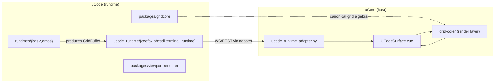

# uCore ↔ uCode Role Boundary

**Date:** 2026-08-14
**Status:** Active
**Purpose:** Defines the canonical ownership split between **uCore** (the host) and **uCode** (the runtime). Grid, teletext, terminal, and GridSmith functionality spans both repos; this document is the single source of truth for which repo owns what.

---

## One-line summary

- **uCore** hosts and renders — the surface chrome, the grid render/data layer, and the route adapters that delegate to uCode.
- **uCode** executes — the grid algebra packages, the BBC BASIC/AMOS runtimes, the Ceefax/terminal Python runtime, and the GridSmith agent.

---

## uCore — the Host

uCore is the platform daemon + extension registry + UI hub. It never executes grid/runtime logic; it renders what uCode produces.

| Concern | Location (uCore) |
|---------|------------------|
| **uCode surface UI** (tabs, chrome, controls) | `frontend-vue/src/surfaces/ucode/UCodeSurface.vue` |
| **Grid render/data layer** (buffer, algebra, palette, G0 renderer, `<gridui-canvas>` Web Component) | `frontend-vue/src/grid-core/` |
| **GridCore styles** (`--gridcore-*` variables) | `frontend-vue/src/styles/gridcore.css` |
| **GridCore settings store** | `frontend-vue/src/stores/gridcoreSettings.ts` |
| **Runtime route adapters** (thin, delegate to uCode) | `backend/app/extensions/adapters/ucode_runtime_adapter.py` |
| **GridSmith bridge** | `backend/app/services/gridsmith_bridge.py` |

### Backend adapter contract (uCore → uCode)

`ucode_runtime_adapter.py` keeps uCore's routing thin. It resolves, at import time, external callables from the uCode repo:

| Callable | Default dotted path (in uCode) |
|----------|-------------------------------|
| Ceefax route registrar | `ucode_runtime.ceefax.register_ceefax_routes` |
| BBCSDL route registrar | `ucode_runtime.bbcsdl.register_bbcsdl_routes` |
| Terminal WS handler | `ucode_runtime.terminal_runtime.handle_terminal_runtime_ws` |
| Ceefax store factory | `ucode_runtime.ceefax.CeefaxStore` |

The uCode repo is located via `UCORE_UCODE_PATH` (default `~/Code/uCode`). These registrars are a hard dependency: if uCode is absent, uCore's backend cannot start.

---

## uCode — the Runtime

uCode is the execution engine and the canonical home of grid algebra. It knows nothing about uCore's surface chrome.

| Concern | Location (uCode) |
|---------|------------------|
| **Grid algebra package** (geometry, buffer, layers, teletext, terminal, spatial, editor, fonts) | `~/Code/uCode/packages/gridcore/` |
| **Viewport renderer** (CanvasViewport, DOMViewport, Teletext/Terminal widgets, fonts, USX palette) | `~/Code/uCode/packages/viewport-renderer/` |
| **Python runtime** (Ceefax, BBCSDL, terminal/PTY) | `~/Code/uCode/ucode_runtime/` |
| **Runtimes** (BBC BASIC for SDL, AMOS shim) | `~/Code/uCode/runtimes/{basic,amos}` |
| **GridSmith agent** | `~/Code/uCode/agents/gridsmith` |
| **GridCore workspace** | `~/Code/uCode/workspaces/gridcore` |
| **Programs / snacks** | `~/Code/uCode/programs/` |

---

## Data flow

- The **runtime** (uCode) produces `GridBuffer` objects.
- The **adapter** (uCore backend) registers the WS/REST routes that stream those buffers.
- The **surface** (uCore frontend) renders them via the `<gridui-canvas>` Web Component.

---

## Ownership rules

1. Grid **algebra/runtime** logic lives in uCode (`packages/gridcore`, `packages/viewport-renderer`). uCore must not re-implement it.
2. uCore may keep a thin **render/data shim** only until the surface is migrated onto `@udos/gridcore` / `@udos/viewport-renderer` (see `.tasker/backlog/gridcore-ucode-canonical-migration.md`).
3. uCore's backend adapters are **pass-through** — they register routes owned by uCode's runtime and must not contain runtime logic.
4. GridCore styling uses `--gridcore-*` variables (uCore `gridcore.css`); USX tokens style only the outer surface shell.
5. GridSmith (the agent that writes grid programs) lives and runs in uCode; uCore only exposes the bridge route.

## Related docs

- `.tasker/backlog/gridcore-ucode-canonical-migration.md` — pending migration of the uCore surface onto `@udos/gridcore`.
- `docs/GRIDUI_RENDERING_CONTRACT_v3.md` — pixel-exact rendering contract and the 5 surface tabs.
- `docs/specs/GRIDCORE_VARIABLEIZATION_SPEC.md` — `--gridcore-*` variable contract.
- uCode: `docs/UCODE_RUNTIME_SPEC.md` (BBCSDL runtime), `docs/GRIDSMITH_DEV_PLAN.md` (GridSmith), `docs/GRID_ALGEBRA_RELEASE_COLLATION.md`.
